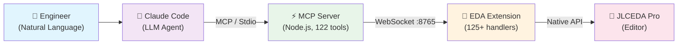

<div align="center">

# AI-EDA

### Intelligent EDA Assistant powered by Claude

**Natural Language → Schematic & PCB Design**

[](LICENSE)
[](#mcp-tools-122)
[](#skills-15)
[](#testing)
[](https://lceda.cn/)
[](https://nodejs.org/)

**English** | [中文](README.zh-CN.md)

</div>

---

MCP (Model Context Protocol) bridge that connects **Claude Code** with **JLCEDA Pro** (嘉立创EDA专业版), enabling hardware engineers to interact with schematic and PCB designs through natural language.

## Why AI-EDA?

Traditional EDA workflows require deep menu navigation and manual repetition. AI-EDA bridges Claude's reasoning with JLCEDA Pro's full API surface — **122 MCP tools** covering schematic, PCB, library, and system operations. Ask in natural language, get results in the editor.

### Key Capabilities

| | Capability | Description |
|---|------------|-------------|
| 📖 | **Read** | List components, nets, layers, DRC rules; query by coordinates or region |
| ✏️ | **Write** | Place components, draw traces, create net flags/labels, modify attributes |
| 🆕 | **Create** | Create projects, schematics, PCBs, boards from scratch |
| 🔍 | **Analyze** | Run DRC, cross-probe SCH↔PCB, generate BOM, export Gerber |
| 🧭 | **Navigate** | Zoom to board, highlight nets, navigate to coordinates |
| ⚙️ | **DRC Management** | Full CRUD for rule configs, net classes, diff pairs, equal-length groups |
| 🔌 | **Routing** | Clear routing, ratline display, coordinate transforms |
| 🤖 | **Automate** | Auto layout/routing, batch operations, natural language → schematic |

## Architecture



| Component | Description |
|-----------|-------------|
| **mcp-server/** | Node.js MCP server — 122 tools via stdio, WebSocket bridge to EDA |
| **eda-extension/** | JLCEDA Pro extension — receives commands, calls EDA API, returns results |
| **.claude/commands/** | 15 skills — domain knowledge + MCP tool guidance |
| **skills/** | Third-party skill integrations (easyeda-api full API reference) |

## Quick Start

### Prerequisites
- [Node.js](https://nodejs.org/) >= 18
- [JLCEDA Pro](https://lceda.cn/) >= 2.3.0
- [Claude Code](https://docs.anthropic.com/en/docs/claude-code)

### 1. Build MCP Server

```bash
cd mcp-server
npm install
npm run build
```

### 2. Build EDA Extension

```bash
cd eda-extension
npm install
npm run build
```

This produces a `.eext` file in `eda-extension/build/dist/`.

### 3. Install EDA Extension

1. Open JLCEDA Pro
2. Go to **Extension Manager**
3. Import the `.eext` file

### 4. Register MCP Server with Claude Code

The project includes `.mcp.json` — update the path if needed:

```json
{
  "mcpServers": {
    "jlceda-bridge": {
      "command": "node",
      "args": ["<path-to>/mcp-server/dist/index.js"],
      "env": { "WS_PORT": "8765" }
    }
  }
}
```

### 5. Install Skills (optional but recommended)

The 15 built-in skills in `.claude/commands/` work automatically when you clone the repo. For the full API reference skill with 120+ class docs:

```bash
npx clawhub@latest install easyeda-api
```

This installs into `skills/easyeda-api/` with complete API documentation (classes, enums, interfaces, guides).

### 6. Connect

1. In JLCEDA Pro **desktop client**, click **AI Bridge → 连接 AI**
2. You should see a success toast: "Connected to MCP Server"
3. In Claude Code, use any `eda_*` tool to interact with the design

> **Important:** The web version of JLCEDA Pro cannot connect to local WebSocket due to HTTPS mixed content restrictions. Use the **desktop client**.

## Usage Examples

```
> Give me an overview of the current design
  → eda_get_design_overview (auto-detects SCH/PCB)

> Find component U1 and show its context
  → eda_find_component → eda_sch_get_component_context

> Check the design for errors
  → eda_check_design (DRC + net analysis + report)

> Highlight the VCC net on the PCB
  → eda_pcb_highlight_net with net="VCC"

> Auto-layout the schematic
  → eda_sch_auto_layout

> Create a Power net class for VCC, 3V3, 5V
  → eda_pcb_create_net_class with name="Power", nets=["VCC","3V3","5V"]

> Export Gerber files for fabrication
  → eda_pcb_export_gerber

> /project:review-pcb decoupling capacitors
  → systematic PCB review with domain rules

> /project:design-check all
  → pre-fabrication check: DRC + SCH↔PCB cross-ref + BOM

> /project:review-sch power bypass
  → schematic review: bypass caps, pull-ups, floating pins, ESD

> /project:generate-schematic ESP32 temperature sensor with OLED display
  → auto-generate schematic from natural language description

> /project:eda-ref
  → browse full API reference (120 classes, 62 enums, 70 interfaces)
```

## Using Skills

Skills are slash commands that combine domain knowledge with MCP tool sequences. They run inside Claude Code.

### How to invoke

```bash
# In Claude Code, type the slash command:
/project:review-sch           # Review current schematic
/project:review-pcb           # Review PCB layout
/project:design-check         # Pre-fabrication check
/project:generate-schematic   # Generate schematic from description
/project:component-research   # Research components in library
/project:eda-ref              # Browse full API reference

# With arguments:
/project:review-sch power bypass capacitors
/project:generate-schematic STM32 minimal system with USB and SD card
/project:component-research STM32F103 LQFP-64
```

### Skill categories

| Category | Skills | When to use |
|----------|--------|-------------|
| **Design Review** | `review-sch`, `review-pcb`, `design-check` | Before sending to production, after major changes |
| **Design Automation** | `generate-schematic`, `place-components`, `route-traces` | Creating new designs, layout optimization |
| **Research** | `component-research`, `electrical-rules` | Selecting components, checking design rules |
| **API Reference** | `eda`, `eda-sch`, `eda-pcb`, `eda-lib`, `eda-dmt`, `eda-sys`, `eda-ref` | Developing extensions, debugging API calls |

### Adding custom skills

Create a `.md` file in `.claude/commands/`:

```markdown
# My Custom Skill

`/my-skill <ARGUMENTS>`

Instructions for Claude on how to perform the task.
Use $ARGUMENTS to reference user input.

## Steps
1. Call eda_get_design_overview
2. Analyze the results
3. ...
```

The file name becomes the slash command: `my-skill.md` → `/project:my-skill`

## MCP Tools (122)

> 122 tools across 8 categories. Click to expand each category.

<details>
<summary><b>🔗 Connection (1)</b></summary>

### Connection (1)
| Tool | Description |
|------|-------------|
| `eda_connection_status` | Check EDA extension connection status |

</details>

<details>
<summary><b>📋 Schematic Read (10)</b></summary>

### Schematic Read (10)
| Tool | Description |
|------|-------------|
| `eda_sch_get_state` | Get schematic document state |
| `eda_sch_list_components` | List all components with attributes |
| `eda_sch_list_nets` | List all nets and connections |
| `eda_sch_list_wires` | List all wires |
| `eda_sch_list_primitives` | List primitives by type |
| `eda_sch_get_component` | Get detailed component info by ID |
| `eda_sch_get_component_context` | Get component + connected nets + nearby components |
| `eda_sch_get_selection` | Get currently selected primitive IDs |
| `eda_sch_get_mouse_position` | Get current mouse position on schematic canvas |
| `eda_sch_get_primitives_bbox` | Get bounding box of primitives by IDs |

</details>

<details>
<summary><b>✏️ Schematic Write (18)</b></summary>

### Schematic Write (18)
| Tool | Description |
|------|-------------|
| `eda_sch_place_component` | Place a component on the schematic |
| `eda_sch_draw_wire` | Draw a wire between points |
| `eda_sch_modify_attribute` | Modify component attributes |
| `eda_sch_delete_primitive` | Delete a primitive |
| `eda_sch_auto_layout` | Trigger automatic schematic layout |
| `eda_sch_auto_routing` | Trigger automatic schematic wire routing |
| `eda_sch_select_primitives` | Select primitives in the editor by IDs |
| `eda_sch_cross_probe` | Cross-probe highlight components/pins/nets |
| `eda_sch_create_net_flag` | Create a net flag (GND, VCC, etc.) |
| `eda_sch_create_net_port` | Create a net port (IN, OUT, BI) |
| `eda_sch_create_net_label` | Place a net label for signal naming |
| `eda_sch_batch_modify` | Batch modify multiple attributes |
| `eda_sch_batch_delete` | Batch delete multiple primitives |
| `eda_sch_save` | Save schematic document |
| `eda_sch_import_changes` | Import changes from PCB |
| `eda_sch_clear_selection` | Clear all selection |
| `eda_sch_navigate_to` | Navigate view to specific coordinates |
| `eda_sch_navigate_to_region` | Navigate and zoom to fit a region |

</details>

<details>
<summary><b>📋 PCB Read (16)</b></summary>

### PCB Read (16)
| Tool | Description |
|------|-------------|
| `eda_pcb_get_state` | Get PCB document state |
| `eda_pcb_list_components` | List all PCB components |
| `eda_pcb_list_nets` | List all PCB nets with lengths |
| `eda_pcb_list_layers` | Get layer stack info |
| `eda_pcb_list_primitives` | List primitives by type/layer |
| `eda_pcb_get_component` | Get detailed PCB component info |
| `eda_pcb_get_component_context` | Get component + connected nets + nearby components |
| `eda_pcb_navigate_to` | Navigate editor view to coordinates |
| `eda_pcb_zoom_to_board` | Zoom to fit board outline |
| `eda_pcb_get_primitive_at_point` | Get primitive at specific coordinates |
| `eda_pcb_get_primitives_in_region` | Get all primitives in a rectangular area |
| `eda_pcb_get_net_primitives` | Get all primitives belonging to a net |
| `eda_pcb_get_netlist` | Get PCB netlist data |
| `eda_pcb_get_selection` | Get currently selected primitive IDs |
| `eda_pcb_convert_canvas_to_data` | Convert canvas UI coordinates to data coordinates |
| `eda_pcb_convert_data_to_canvas` | Convert data coordinates to canvas UI coordinates |

</details>

<details>
<summary><b>✏️ PCB Write (45)</b></summary>

### PCB Write (45)
| Tool | Description |
|------|-------------|
| `eda_pcb_place_component` | Place a component on PCB |
| `eda_pcb_draw_line` | Draw a copper trace |
| `eda_pcb_draw_arc` | Draw an arc trace |
| `eda_pcb_draw_polyline` | Draw a polyline |
| `eda_pcb_place_via` | Place a via |
| `eda_pcb_place_text` | Place silkscreen text |
| `eda_pcb_place_dimension` | Place a dimension annotation |
| `eda_pcb_create_pour` | Create a copper pour |
| `eda_pcb_create_region` | Create a keep-out/constraint region |
| `eda_pcb_create_fill` | Create a fill region |
| `eda_pcb_modify_attribute` | Modify PCB primitive attributes |
| `eda_pcb_delete_primitive` | Delete a PCB primitive |
| `eda_pcb_batch_move` | Batch move multiple components |
| `eda_pcb_batch_modify` | Batch modify multiple attributes |
| `eda_pcb_batch_delete` | Batch delete multiple primitives |
| `eda_pcb_save` | Save PCB document |
| `eda_pcb_import_changes` | Import changes from schematic |
| `eda_pcb_highlight_net` | Highlight a net |
| `eda_pcb_unhighlight_net` | Remove net highlight |
| `eda_pcb_select_net` | Select all primitives of a net |
| `eda_pcb_select_primitives` | Select primitives by IDs |
| `eda_pcb_cross_probe` | Cross-probe highlight components/pins/nets |
| `eda_pcb_clear_selection` | Clear all selection |
| `eda_pcb_select_layer` | Set active layer |
| `eda_pcb_set_layer_visibility` | Show/hide a layer |
| `eda_pcb_set_copper_layers` | Set number of copper layers |
| `eda_pcb_get_drc_rules` | Get current DRC rule configuration |
| `eda_pcb_get_all_rule_configs` | Get all DRC rule configurations |
| `eda_pcb_save_rule_config` | Save/create a DRC rule configuration |
| `eda_pcb_rename_rule_config` | Rename a DRC rule configuration |
| `eda_pcb_delete_rule_config` | Delete a custom DRC rule configuration |
| `eda_pcb_overwrite_net_rules` | Overwrite net-specific DRC rules |
| `eda_pcb_get_net_by_net_rules` | Get net-to-net clearance rules |
| `eda_pcb_overwrite_region_rules` | Overwrite region constraint rules |
| `eda_pcb_get_net_classes` | Get all net class definitions |
| `eda_pcb_create_net_class` | Create a net class grouping |
| `eda_pcb_delete_net_class` | Delete a net class |
| `eda_pcb_add_net_to_net_class` | Add nets to a net class |
| `eda_pcb_remove_net_from_net_class` | Remove nets from a net class |
| `eda_pcb_get_diff_pairs` | Get all differential pair definitions |
| `eda_pcb_create_diff_pair` | Create a differential pair |
| `eda_pcb_delete_diff_pair` | Delete a differential pair |
| `eda_pcb_get_equal_length_groups` | Get all equal-length net groups |
| `eda_pcb_create_equal_length_group` | Create an equal-length net group |
| `eda_pcb_delete_equal_length_group` | Delete an equal-length net group |
| `eda_pcb_get_pad_pair_groups` | Get all pad pair groups |
| `eda_pcb_clear_routing` | Clear routing (all/net/connection) |
| `eda_pcb_start_ratline` | Start ratline calculation/display |
| `eda_pcb_stop_ratline` | Stop ratline display |
| `eda_pcb_get_ratline_status` | Get ratline calculation status |
| `eda_pcb_export_gerber` | Export Gerber manufacturing files |
| `eda_pcb_export_pick_place` | Export pick-and-place file |
| `eda_pcb_get_mouse_position` | Get current mouse position on PCB canvas |

</details>

<details>
<summary><b>📁 Document Management (11)</b></summary>

### Document Management (11)
| Tool | Description |
|------|-------------|
| `eda_dmt_get_document_info` | Get current document type and UUID |
| `eda_dmt_open_document` | Open a document by UUID |
| `eda_dmt_get_project_info` | Get project details |
| `eda_dmt_list_boards` | List all boards in the project |
| `eda_dmt_get_board_info` | Get board details (linked SCH/PCB) |
| `eda_dmt_list_tabs` | List open editor tabs |
| `eda_dmt_create_project` | Create a new project |
| `eda_dmt_create_schematic` | Create a new schematic document |
| `eda_dmt_create_schematic_page` | Create a new schematic page |
| `eda_dmt_create_pcb` | Create a new PCB document |
| `eda_dmt_create_board` | Create a board linking SCH and PCB |

</details>

<details>
<summary><b>📦 Library (5)</b></summary>

### Library (5)
| Tool | Description |
|------|-------------|
| `eda_lib_search_device` | Search component library by keyword |
| `eda_lib_get_device` | Get full device details |
| `eda_lib_search_footprint` | Search footprint library |
| `eda_lib_get_libraries` | List all available libraries |
| `eda_lib_get_device_by_lcsc` | Lookup devices by LCSC part numbers |

</details>

<details>
<summary><b>🔧 System & Composite (12)</b></summary>

### System & Composite (12)
| Tool | Description |
|------|-------------|
| `eda_sys_run_drc` | Run Design Rule Check (SCH or PCB) |
| `eda_sys_export_bom` | Export Bill of Materials |
| `eda_sys_get_document_info` | Get editor version and platform info |
| `eda_sys_show_message` | Show toast notification in EDA |
| `eda_sys_get_environment` | Get environment flags |
| `eda_sys_get_user_config` | Get stored user configurations |
| `eda_sys_unit_convert` | Convert between mil/mm/inch |
| `eda_sys_open_url` | Open URL in browser |
| `eda_get_design_overview` | One-call design overview — auto-detects SCH/PCB |
| `eda_find_component` | Smart search by designator/value/footprint |
| `eda_check_design` | DRC + net analysis + human-readable report |
| `eda_sch_get_bom` | BOM data grouped by value/footprint |

</details>

## Skills (15)

In addition to the 122 MCP tools, the project includes **skills** — slash commands that inject EDA domain knowledge and guide Claude through multi-step design tasks.

### API Reference Skills (7)
| Skill | Description |
|-------|-------------|
| `/project:eda` | Master EDA API reference with calling conventions |
| `/project:eda-sch` | Schematic API — 15 classes, full method signatures |
| `/project:eda-pcb` | PCB API — 22 classes, full method signatures |
| `/project:eda-lib` | Library API — 9 classes (device, symbol, footprint, 3D model) |
| `/project:eda-dmt` | Document tree API — 10 classes (project, board, editor control) |
| `/project:eda-sys` | System API — 20+ classes (file, dialog, menu, storage, unit) |
| `/project:eda-ref` | **Full API reference** — 120 classes, 62 enums, 70 interfaces index |

### Design Workflow Skills (6)
| Skill | Description |
|-------|-------------|
| `/project:generate-schematic` | **Natural language → schematic** via MCP API |
| `/project:review-pcb` | PCB layout review — decoupling caps, power traces, DRC rules, DFM, SI |
| `/project:review-sch` | Schematic review — bypass caps, pull-ups, floating pins, ESD |
| `/project:design-check` | Pre-fab check — DRC + board consistency + SCH↔PCB cross-ref + BOM |
| `/project:place-components` | PCB placement — functional grouping, priority, grid alignment |
| `/project:route-traces` | PCB routing — ratline display, trace width, vias, diff pairs, layer strategy |

### Knowledge Skills (2)
| Skill | Description |
|-------|-------------|
| `/project:electrical-rules` | Electrical design rules — pin types, power, signal integrity, protection |
| `/project:component-research` | Component research — library search, datasheet lookup, parameter extraction |

> **Design pattern:** Skills combine **domain knowledge** (EDA design rules, numeric thresholds) with **MCP tool sequences** (which tools to call and in what order). All method signatures sourced from `@jlceda/pro-api-types` v0.2.15.

## Project Structure

```
AI-EDA/
├── mcp-server/                  # MCP Server (Node.js/TypeScript)
│   ├── src/
│   │   ├── index.ts             # Server entry — registers all 122 tools
│   │   ├── ws-bridge.ts         # WebSocket server, request/response matching
│   │   ├── protocol.ts          # Shared command enum (synced with extension)
│   │   ├── tools/               # MCP tool definitions (Zod schemas)
│   │   │   ├── connection.ts    # 1 tool
│   │   │   ├── schematic-read.ts  # 10 tools
│   │   │   ├── schematic-write.ts # 18 tools
│   │   │   ├── pcb-read.ts      # 16 tools
│   │   │   ├── pcb-write.ts     # 45 tools
│   │   │   └── system.ts        # 32 tools (DMT + LIB + SYS + composite)
│   │   └── __tests__/           # Vitest test suites
│   │       ├── protocol-sync.test.ts    # Protocol enum sync verification
│   │       ├── tool-registration.test.ts # Tool registration validation
│   │       └── ws-bridge.test.ts        # WebSocket bridge unit tests
│   ├── vitest.config.ts
│   ├── package.json
│   └── tsconfig.json
│
├── eda-extension/               # JLCEDA Pro Extension
│   ├── src/
│   │   ├── index.ts             # Extension entry — menu actions, auto-connect
│   │   ├── ws-client.ts         # WebSocket client via eda.sys_WebSocket
│   │   ├── dispatcher.ts        # Command router + logging + stats
│   │   ├── protocol.ts          # Shared command enum (synced with server)
│   │   └── handlers/            # EDA API call implementations
│   │       ├── schematic-read.ts
│   │       ├── schematic-write.ts
│   │       ├── pcb-read.ts
│   │       ├── pcb-write.ts
│   │       └── system.ts
│   ├── iframe/
│   │   ├── panel.html          # Status panel (connection, stats, command log)
│   │   └── ai-panel.html       # Full AI assistant panel (dashboard, actions, log, about)
│   ├── extension.json           # Extension manifest (v1.2.0)
│   ├── package.json
│   └── tsconfig.json
│
├── .claude/commands/            # Claude Code skills (15 files)
│   ├── eda.md                  # Master API reference
│   ├── eda-sch.md              # Schematic API
│   ├── eda-pcb.md              # PCB API
│   ├── eda-lib.md              # Library API
│   ├── eda-dmt.md              # Document tree API
│   ├── eda-sys.md              # System API
│   ├── generate-schematic.md   # Natural language → schematic
│   ├── review-pcb.md           # PCB layout review
│   ├── review-sch.md           # Schematic review
│   ├── design-check.md         # Pre-fabrication design check
│   ├── place-components.md     # PCB component placement
│   ├── route-traces.md         # PCB trace routing
│   ├── electrical-rules.md     # Electrical design rules
│   └── component-research.md   # Component research
│
├── skills/                      # Third-party skill integrations
│   └── easyeda-api/            # Full API reference (120 classes, 62 enums, 70 interfaces)
│
├── .mcp.json                    # MCP server registration
├── CONTRIBUTING.md              # Contribution guide
├── LICENSE                      # MIT license
└── .gitignore
```

## Tech Stack

- **MCP Server**: `@modelcontextprotocol/sdk`, `ws`, `zod`, TypeScript
- **EDA Extension**: JLCEDA Pro Extension API, `@jlceda/pro-api-types` v0.2.15, TypeScript
- **Protocol**: WebSocket (JSON request/response with UUID matching)
- **Build**: esbuild (extension), tsc (server)

## Testing

```bash
cd mcp-server
npm test          # Run all tests (vitest)
npm run test:watch  # Watch mode
```

3 test suites, 19 tests:
- **Protocol sync** — verifies both `protocol.ts` files have identical enum values
- **Tool registration** — verifies all 122 tools register without errors, no duplicates
- **WSBridge** — WebSocket server start/connect/send/receive/timeout behavior

## Version History

| Version | Tools | Skills | Highlights |
|---------|-------|--------|------------|
| v2.1.0 | 122 | 15 | **AI Assistant Panel** — full-featured UI in EDA editor (dashboard, quick actions, activity log), full API reference integration, modify_attribute key normalization fix |
| v2.0.0 | 122 | 14 | Document creation, DRC CRUD, routing control, net labels, coordinate transforms, test infrastructure, generate-schematic skill |
| v1.9.0 | 93 | 13 | UI enhancement — status panel, port config, auto-connect, context menus |
| v1.8.0 | 93 | 11 | Complete coverage — SCH/PCB primitives, DMT, LIB, SYS |
| v1.7.0 | 65 | 11 | PCB full coverage — document, net, selection, layer, DRC rules, manufacturing |
| v1.6.0 | 40 | 11 | SCH full coverage — auto layout, cross-probe, BOM, net flags |
| v1.5.0 | 31 | 11 | Workflow skills — domain knowledge + MCP tool guidance |

## Screenshots

> Coming soon — AI Assistant Panel, Schematic Review Report, PCB Layout Analysis

<!--
Add screenshots here:


-->

## License

MIT

---

<div align="center">

**[Documentation](README.md)** · **[中文文档](README.zh-CN.md)** · **[Contributing](CONTRIBUTING.md)** · **[Report Bug](https://github.com/keiller9/AI-EDA/issues)**

Made with Claude Code + JLCEDA Pro

</div>
